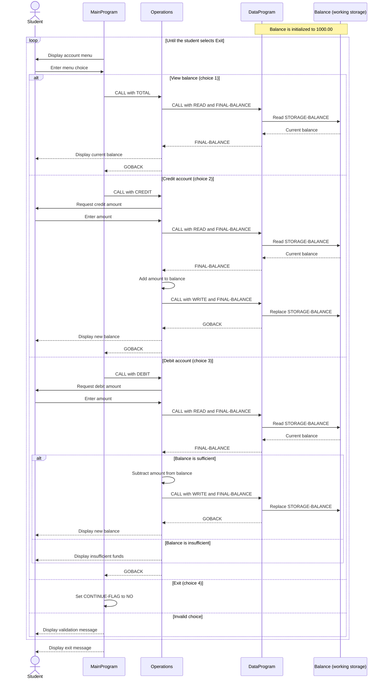

# COBOL Student Account System

## Overview

The COBOL source in `src/cobol` implements a small, menu-driven account
management system. In the context of student accounts, it supports viewing an
account balance, applying a credit, and applying a debit.

The current implementation models one shared student account for the lifetime
of the running process. It does not store student identifiers, maintain
separate balances for multiple students, or persist data after the program
ends.

## Source Files

### `main.cob` - User Interface and Control Flow

`MainProgram` is the application entry point. It repeatedly displays the
account menu, accepts the user's selection, and delegates account actions to
the `Operations` program.

Key behavior:

- `MAIN-LOGIC` runs the menu loop until the user selects **4. Exit**.
- Choice **1** calls `Operations` with `TOTAL` to display the balance.
- Choice **2** calls `Operations` with `CREDIT` to add funds.
- Choice **3** calls `Operations` with `DEBIT` to remove funds.
- Values outside 1 through 4 produce an error and redisplay the menu.

### `operations.cob` - Account Transactions

`Operations` contains the business logic for balance inquiries, credits, and
debits. It receives a six-character operation code from `MainProgram` and uses
`DataProgram` to read or update the balance.

Key operations:

- `TOTAL` reads the stored balance and displays it without changing it.
- `CREDIT` accepts an amount, adds it to the current balance, saves the result,
  and displays the new balance.
- `DEBIT` accepts an amount and compares it with the current balance. If
  sufficient funds are available, it subtracts and saves the amount. Otherwise,
  it leaves the balance unchanged and displays an insufficient-funds message.

### `data.cob` - Balance Storage

`DataProgram` owns the account balance and provides a small read/write
interface for `Operations`.

Key operations:

- `READ` copies `STORAGE-BALANCE` into the balance supplied by the caller.
- `WRITE` replaces `STORAGE-BALANCE` with the balance supplied by the caller.
- `STORAGE-BALANCE` is initialized to `1000.00` when the program is loaded.

This storage is held in COBOL working storage. There is no database or file
backing it, so the account returns to its initial value in a new application
run.

## Student Account Business Rules

1. **Opening balance:** The account starts with a balance of `1000.00`.
2. **Credits:** A credit increases the balance by the full amount entered.
3. **Debits:** A debit is approved only when the current balance is greater
   than or equal to the requested amount.
4. **No overdrafts:** A rejected debit does not modify the balance.
5. **Amount format:** Balances and transaction amounts use `PIC 9(6)V99`, which
   supports non-negative values with up to six whole-number digits and two
   decimal digits (a maximum represented value of `999999.99`).
6. **Single account:** All operations affect the same balance. The application
   does not associate the balance with a student ID or support multiple student
   accounts.
7. **Process-lifetime storage:** Balance changes are available to later
   operations during the current run, but are not persisted for future runs.
8. **Input assumptions:** Transaction input is accepted directly into an
   unsigned numeric field. The application does not explicitly validate
   malformed input, enforce a minimum transaction amount, or handle balance
   overflow.

## Program Flow

```text
MainProgram
  -> Operations (TOTAL / CREDIT / DEBIT)
       -> DataProgram (READ)
       -> apply transaction rule
       -> DataProgram (WRITE, for an approved balance change)
```

## Sequence Diagram


